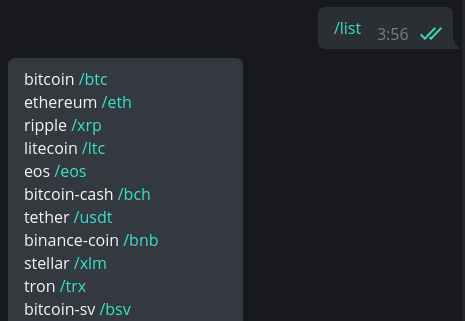
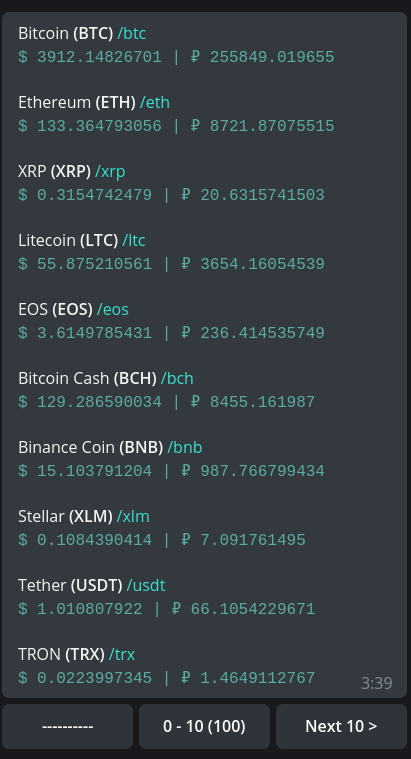
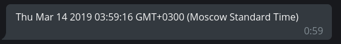
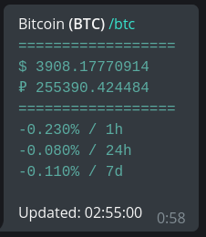

# Crypto Info Bot

## Overview

The Telegram bot for currency rates monitoring. It shows the top 100 currencies from the Coinmarketcap with **the real-time** updating messages.

## Usage

There is a list of static commands:

- **`/list`** - shows the list of supported coins as commands.

  

- **`/rates`** - shows the paginated list of supported coins with rates inline.

  

- **`/time`** - just a checker the real-time features are available.

  

Also, there are dynamically generated commands which are equal to coins tickers. For example **`/btc`** or **`/ltc`**.

## Contributing

 ## Credits

- **Denis Efremov** - *Code|Idea* - [Piterden](https://github.com/Piterden)

## License

This project is licensed under the MIT License - see the [LICENSE.md](https://github.com/Piterden/chessbot/blob/master/LICENSE.md) file for details